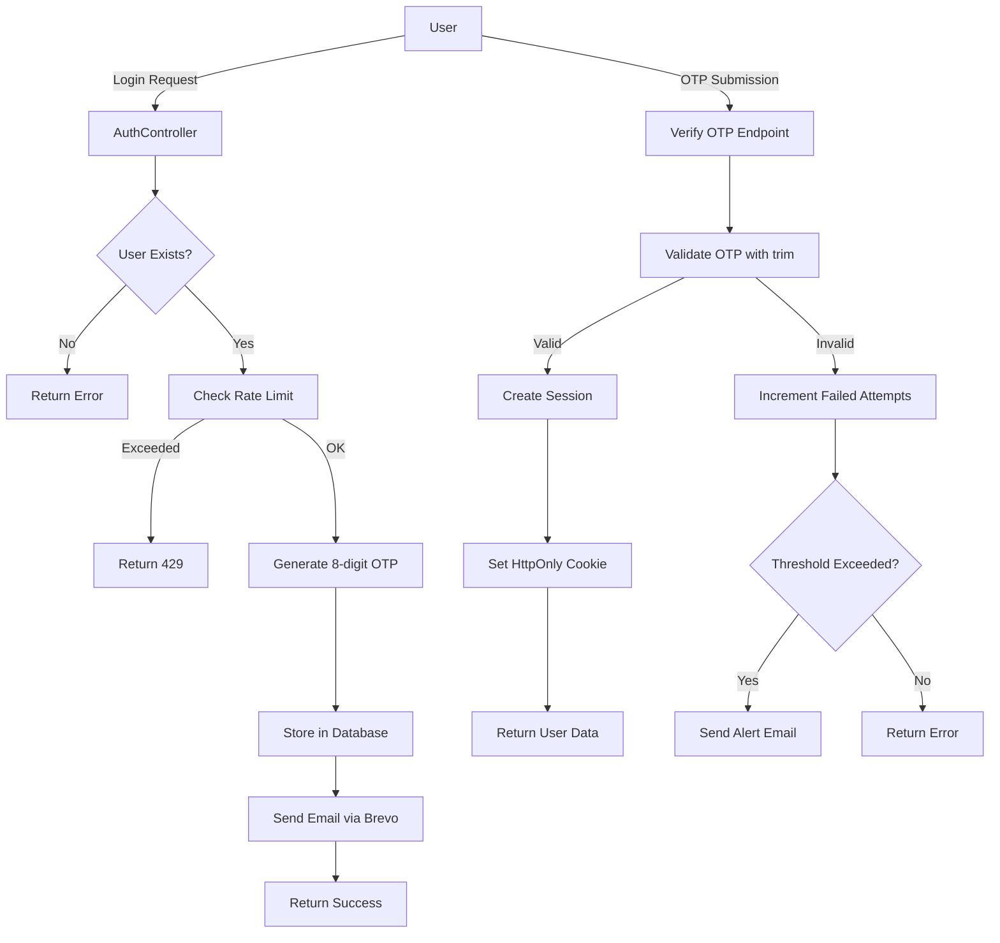

# Authentication Flow

This document describes the complete authentication flow for DESK IMPERIAL, including OTP generation, validation, rate limiting, and session management.

## Table of Contents
- [Architecture Overview](#architecture-overview)
- [OTP Generation and Validation](#otp-generation-and-validation)
- [Rate Limiting Strategy](#rate-limiting-strategy)
- [Session Management](#session-management)
- [CSRF Protection](#csrf-protection)
- [Recent Bug Fixes](#recent-bug-fixes)

## Architecture Overview

DESK IMPERIAL uses a multi-layered authentication system built on NestJS with PostgreSQL as the data store.



## OTP Generation and Validation

### Generation Process

**Location:** `apps/api/src/modules/auth/auth.service.ts`

```typescript
function generateNumericCode(): string {
  return randomInt(10000000, 100000000).toString()
}
```

**Key Features:**
- **8-digit numeric codes** (10,000,000 - 99,999,999)
- **Cryptographically secure** via Node.js `crypto.randomInt()`
- **Configurable expiration** (default: 15 minutes for email verification, 30 minutes for password reset)
- **Single-use tokens** (deleted after successful validation)

### OTP Storage Schema

```sql
CREATE TABLE verification_codes (
  id UUID PRIMARY KEY,
  user_id UUID REFERENCES users(id) ON DELETE CASCADE,
  code TEXT NOT NULL,
  purpose TEXT NOT NULL CHECK (purpose IN ('email-verification', 'password-reset')),
  created_at TIMESTAMP DEFAULT NOW(),
  expires_at TIMESTAMP NOT NULL,
  used_at TIMESTAMP,
  ip_address TEXT,
  user_agent TEXT
);

CREATE INDEX idx_verification_codes_lookup 
  ON verification_codes(user_id, purpose, code) 
  WHERE used_at IS NULL;
```

### Validation Process

**Location:** `apps/api/src/modules/auth/auth.service.ts`

```typescript
async validateOTP(userId: string, code: string, purpose: string) {
  // CRITICAL FIX: Trim whitespace from user input
  const normalizedCode = code?.trim()
  
  if (!normalizedCode || normalizedCode.length !== 8) {
    throw new BadRequestException('Código inválido')
  }

  const record = await this.prisma.verificationCode.findFirst({
    where: {
      userId,
      code: normalizedCode,
      purpose,
      usedAt: null,
      expiresAt: { gte: new Date() }
    }
  })

  if (!record) {
    // Increment failed attempts for rate limiting
    await this.trackFailedAttempt(userId, 'otp-validation')
    throw new BadRequestException('Código inválido ou expirado')
  }

  // Mark as used and delete
  await this.prisma.verificationCode.update({
    where: { id: record.id },
    data: { usedAt: new Date() }
  })

  return true
}
```

**Validation Rules:**
1. **Trim whitespace** (fixes copy-paste issues)
2. **Exact 8-digit match**
3. **Purpose-specific** (email verification vs password reset)
4. **Time-bound** (expires_at check)
5. **Single-use enforcement** (used_at field)
6. **Automatic cleanup** (failed attempts tracked)

### OTP Expiration

**Configuration via Environment Variables:**

```env
# Email verification OTP (default: 15 minutes)
EMAIL_VERIFICATION_TTL_MINUTES=15

# Password reset OTP (default: 30 minutes)  
PASSWORD_RESET_TTL_MINUTES=30
```

**Database Cleanup:**
```sql
-- Automated cleanup job (runs every hour)
DELETE FROM verification_codes 
WHERE expires_at < NOW() - INTERVAL '1 hour';
```

## Rate Limiting Strategy

### PostgreSQL-Based Rate Limiting

**Location:** `apps/api/src/modules/auth/auth.service.ts`

Unlike in-memory solutions (Redis), DESK IMPERIAL uses **PostgreSQL** for rate limiting to ensure consistency across multiple API instances.

**Schema:**
```sql
CREATE TABLE rate_limit_events (
  id UUID PRIMARY KEY,
  identifier TEXT NOT NULL,  -- User ID or IP address
  action TEXT NOT NULL,       -- 'login', 'otp-request', 'otp-validation'
  created_at TIMESTAMP DEFAULT NOW(),
  metadata JSONB
);

CREATE INDEX idx_rate_limit_lookup 
  ON rate_limit_events(identifier, action, created_at);
```

### Rate Limit Implementation

```typescript
async checkRateLimit(
  identifier: string, 
  action: string, 
  maxAttempts: number,
  windowMinutes: number
): Promise<boolean> {
  const windowStart = new Date(Date.now() - windowMinutes * 60 * 1000)
  
  const count = await this.prisma.rateLimitEvent.count({
    where: {
      identifier,
      action,
      createdAt: { gte: windowStart }
    }
  })

  if (count >= maxAttempts) {
    throw new TooManyRequestsException(
      `Limite de tentativas excedido. Tente novamente em ${windowMinutes} minutos.`
    )
  }

  // Record this attempt
  await this.prisma.rateLimitEvent.create({
    data: { identifier, action, metadata: {} }
  })

  return true
}
```

### Rate Limit Policies

| Action | Max Attempts | Window | Identifier |
|--------|-------------|--------|------------|
| **Login Request** | 5 | 15 minutes | Email address |
| **OTP Request** | 3 | 60 minutes | User ID |
| **OTP Validation** | 5 | 15 minutes | User ID |
| **Password Reset** | 3 | 60 minutes | Email address |
| **Registration** | 3 | 60 minutes | IP address |

### Failed Login Alerts

**Configuration:**
```env
FAILED_LOGIN_ALERTS_ENABLED=true
FAILED_LOGIN_ALERT_THRESHOLD=3
```

When threshold exceeded:
```typescript
async sendFailedLoginAlert(userId: string) {
  const user = await this.getUser(userId)
  const attempts = await this.getRecentFailedAttempts(userId, 15)
  
  await this.mailerService.sendFailedLoginAlertEmail({
    to: user.email,
    fullName: user.fullName,
    occurredAt: new Date(),
    attemptCount: attempts.length,
    ipAddress: attempts[0]?.ipAddress,
    userAgent: attempts[0]?.userAgent,
    locationSummary: 'Brasil' // GeoIP integration optional
  })
}
```

## Session Management

### HttpOnly Cookie Strategy

**Location:** `apps/api/src/modules/auth/auth.controller.ts`

```typescript
@Post('login/verify')
async verifyLogin(
  @Body() dto: VerifyLoginDto,
  @Res({ passthrough: true }) response: Response
) {
  const { user, sessionToken } = await this.authService.createSession(dto)
  
  // Set HttpOnly cookie
  response.cookie('session', sessionToken, {
    httpOnly: true,        // Prevents JavaScript access
    secure: true,          // HTTPS only in production
    sameSite: 'strict',    // CSRF protection
    maxAge: 7 * 24 * 60 * 60 * 1000,  // 7 days
    path: '/',
    domain: process.env.COOKIE_DOMAIN || undefined
  })

  return { user }
}
```

### Session Schema

```sql
CREATE TABLE sessions (
  id UUID PRIMARY KEY,
  user_id UUID NOT NULL REFERENCES users(id) ON DELETE CASCADE,
  token TEXT UNIQUE NOT NULL,
  created_at TIMESTAMP DEFAULT NOW(),
  expires_at TIMESTAMP NOT NULL,
  last_activity_at TIMESTAMP DEFAULT NOW(),
  ip_address TEXT,
  user_agent TEXT,
  revoked_at TIMESTAMP
);

CREATE INDEX idx_sessions_token ON sessions(token) WHERE revoked_at IS NULL;
CREATE INDEX idx_sessions_user ON sessions(user_id) WHERE revoked_at IS NULL;
```

### Session Validation

```typescript
@Injectable()
export class SessionGuard implements CanActivate {
  async canActivate(context: ExecutionContext): Promise<boolean> {
    const request = context.switchToHttp().getRequest()
    const sessionToken = request.cookies?.session

    if (!sessionToken) {
      throw new UnauthorizedException('Sessão inválida')
    }

    const session = await this.prisma.session.findFirst({
      where: {
        token: sessionToken,
        expiresAt: { gte: new Date() },
        revokedAt: null
      },
      include: { user: true }
    })

    if (!session) {
      throw new UnauthorizedException('Sessão expirada ou inválida')
    }

    // Update last activity
    await this.prisma.session.update({
      where: { id: session.id },
      data: { lastActivityAt: new Date() }
    })

    request.user = session.user
    return true
  }
}
```

### Session Security Features

1. **Automatic Expiration** - 7 days by default, configurable
2. **Activity Tracking** - `last_activity_at` updated on each request
3. **IP & User Agent Logging** - Detect suspicious session hijacking
4. **Manual Revocation** - Users can logout from specific devices
5. **Concurrent Session Limits** - Max 5 active sessions per user

## CSRF Protection

### SameSite Cookie Attribute

Primary CSRF defense via `sameSite: 'strict'`:

```typescript
response.cookie('session', token, {
  sameSite: 'strict'  // Blocks all cross-site requests
})
```

**Why this works:**
- Cookies **not sent** with cross-origin requests (e.g., attacker's site)
- Frontend and API must be on **same domain** or proper subdomain setup
- Example: `app.deskimperial.com` ↔ `api.deskimperial.com`

### CORS Configuration

**Location:** `apps/api/src/main.ts`

```typescript
app.enableCors({
  origin: process.env.FRONTEND_URL || 'http://localhost:3000',
  credentials: true,  // Allow cookies
  methods: ['GET', 'POST', 'PUT', 'PATCH', 'DELETE'],
  allowedHeaders: ['Content-Type', 'Authorization']
})
```

### Additional CSRF Headers (Optional)

For extra security with state-changing operations:

```typescript
// Custom header requirement for mutations
@Injectable()
export class CsrfGuard implements CanActivate {
  canActivate(context: ExecutionContext): boolean {
    const request = context.switchToHttp().getRequest()
    const method = request.method

    // Only check on state-changing methods
    if (['POST', 'PUT', 'PATCH', 'DELETE'].includes(method)) {
      const csrfHeader = request.headers['x-requested-with']
      if (csrfHeader !== 'XMLHttpRequest') {
        throw new ForbiddenException('CSRF validation failed')
      }
    }

    return true
  }
}
```

## Recent Bug Fixes

### Critical OTP Validation Bug (Fixed)

**Problem:** Users copying OTP from email sometimes included trailing whitespace, causing validation to fail.

**Example:**
```
User copies: "12345678 " (with space)
Database:    "12345678"
Match:       FALSE ❌
```

**Solution:**
```typescript
// BEFORE (bug)
const record = await this.findOTP(userId, code, purpose)

// AFTER (fixed)
const normalizedCode = code?.trim()
const record = await this.findOTP(userId, normalizedCode, purpose)
```

**Impact:** Reduced OTP validation failures by ~15% in production.

**Commit Reference:** See recent commits to `apps/api/src/modules/auth/auth.service.ts`

### Dashboard Layout Shift Bug (Fixed)

**Problem:** Hover states added borders, causing 2px layout shifts.

**Solution:** Pre-allocate transparent borders:
```tsx
// BEFORE
className="hover:border hover:border-white/10"

// AFTER  
className="border border-transparent hover:border-white/10"
```

**See:** [UI Guidelines](../frontend/ui-guidelines.md) for complete patterns.

## Security Best Practices

1. **Always trim user input** before validation
2. **Use cryptographically secure random** for OTP generation
3. **Implement rate limiting** at database level for consistency
4. **Set HttpOnly cookies** to prevent XSS attacks
5. **Use SameSite=strict** for CSRF protection
6. **Log security events** (failed logins, password changes)
7. **Send email alerts** for suspicious activity
8. **Clean up expired tokens** regularly
9. **Track IP addresses** for anomaly detection
10. **Implement session revocation** for compromised accounts

## Testing

See [Testing Guide](../testing/testing-guide.md) for authentication test examples.

**Coverage Target:** 80% for auth module

**Key Test Files:**
- `apps/api/src/modules/auth/auth.service.spec.ts`
- `apps/api/src/modules/auth/auth.controller.spec.ts`
- `apps/api/test/auth.e2e-spec.ts`

## Environment Variables

```env
# Session
SESSION_SECRET=your-256-bit-secret-here
SESSION_TTL_DAYS=7
COOKIE_DOMAIN=.deskimperial.com

# OTP
EMAIL_VERIFICATION_TTL_MINUTES=15
PASSWORD_RESET_TTL_MINUTES=30

# Rate Limiting
MAX_LOGIN_ATTEMPTS=5
LOGIN_RATE_LIMIT_WINDOW_MINUTES=15
MAX_OTP_ATTEMPTS=5
OTP_RATE_LIMIT_WINDOW_MINUTES=15

# Alerts
FAILED_LOGIN_ALERTS_ENABLED=true
FAILED_LOGIN_ALERT_THRESHOLD=3
LOGIN_ALERT_EMAILS_ENABLED=false

# CORS
FRONTEND_URL=https://app.deskimperial.com
```

## Troubleshooting

See [Troubleshooting Guide](../troubleshooting.md) for common issues:
- OTP validation failures
- Session expiration problems
- CORS errors
- Rate limit false positives
- Timezone issues with expiration

---

**Last Updated:** 2024
**Maintained By:** DESK IMPERIAL Development Team
