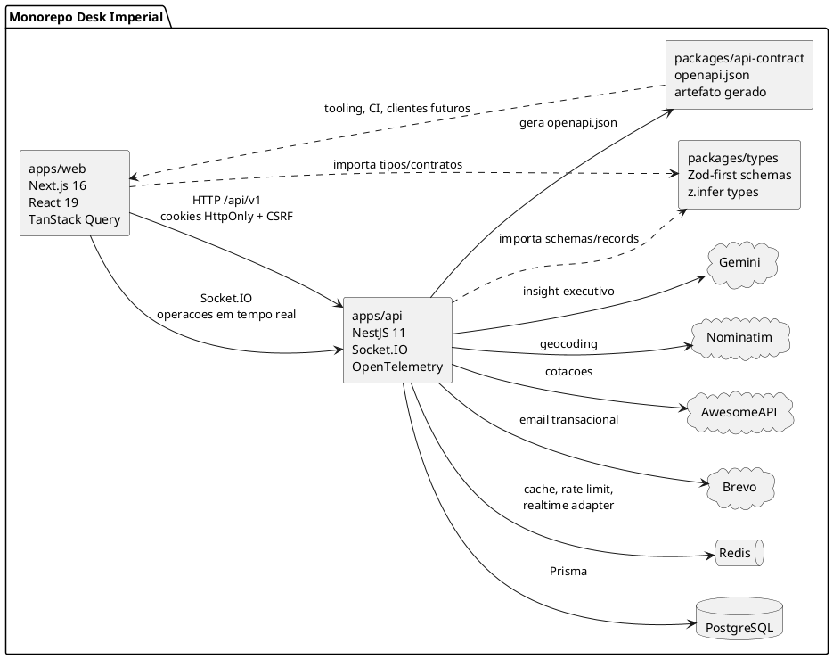
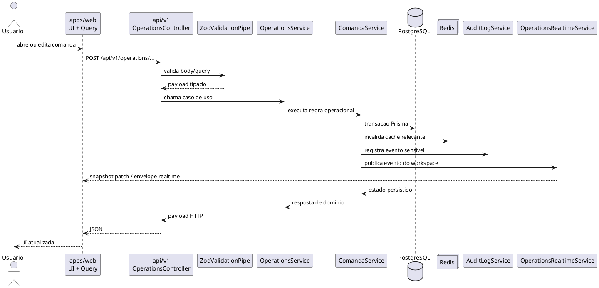

# Mapa do Sistema - Monorepo TS, Zod e OpenAPI

## Escopo

Este documento descreve como o Desk Imperial funciona hoje no nivel de monorepo, contratos, runtime e integracoes externas.

Ele complementa:

- `docs/architecture/overview.md`
- `docs/architecture/modules.md`
- `docs/operations/flows.md`

## Estado atual da modernizacao

Status consolidado em `2026-04-17`:

- baseline TypeScript endurecida no root com `strict`, `noUncheckedIndexedAccess`, `noImplicitOverride`, `exactOptionalPropertyTypes` e `noFallthroughCasesInSwitch`
- API publica consolidada em `/api/v1`
- contratos compartilhados em `packages/types` convertidos para Zod-first com `z.infer`
- geracao de OpenAPI ativa em `packages/api-contract/openapi.json`
- endpoints de documentacao publicados em:
  - `GET /api/v1/openapi.json`
  - `GET /api/v1/docs`
- wave `operations` migrada para validacao na borda com Zod
- outras areas do backend ainda estao em modo misto durante as proximas waves

## Estrutura do monorepo

```text
apps/
  api/          NestJS + Prisma + Redis + Socket.IO
  web/          Next.js App Router + TanStack Query + realtime client
packages/
  types/        contratos Zod compartilhados + tipos inferidos
  api-contract/ openapi.json gerado pela API
infra/
  docker, oracle, observabilidade, deploy
tests/
  carga, smoke, validacoes de ambiente
```

## Regras arquiteturais atuais

- `apps/api` e a fonte de verdade das regras de negocio.
- `apps/web` consome somente `/api/v1`.
- `packages/types` concentra contratos compartilhados entre workspaces.
- `packages/api-contract/openapi.json` e artefato gerado, nao fonte manual.
- Modulos migrados devem validar entrada com Zod e derivar tipo com `z.infer`.
- O Prisma deve ficar contido nas bordas de persistencia conforme as proximas waves avancarem.

## Visao geral do sistema



## Como um fluxo de negocio percorre o sistema

Exemplo: abertura/atualizacao de comanda na wave `operations`.



## Como contratos e OpenAPI sao produzidos

```plantuml
@startuml
skinparam shadowing false

participant "packages/types\ncontracts.ts" as Contracts
participant "operations.schemas.ts\n(modulo migrado)" as ModuleSchemas
participant "operations.openapi.ts" as ModuleOpenApi
participant "common/openapi/registry.ts" as Registry
participant "common/openapi/document.ts" as Document
participant "scripts/generate-openapi.ts" as Script
artifact "packages/api-contract/openapi.json" as Spec

Contracts -> ModuleSchemas : reuso de records e enums
ModuleSchemas -> ModuleOpenApi : schemas request/response
ModuleOpenApi -> Registry : registerPath/register schema
Registry -> Document : definitions acumuladas
Script -> Document : generateApiOpenApiDocument()
Document --> Spec : JSON gerado e commitado
@enduml
```

## Mapa de responsabilidade por workspace

### `apps/web`

- shells owner/staff
- chamadas HTTP centralizadas em `lib/api-*.ts`
- consumo de `/api/v1`
- realtime de operacoes e patches locais
- formularios e refinamentos de UX que nao pertencem ao contrato compartilhado

### `apps/api`

- autenticacao, sessao, CSRF e auditoria
- dominio operacional, comercial e financeiro
- integracao com Postgres, Redis e servicos externos
- geracao do OpenAPI e exposicao da documentacao

### `packages/types`

- schemas Zod compartilhados
- tipos inferidos com `z.infer`
- records de transporte reaproveitados por API e Web
- patterns de validacao reutilizaveis

### `packages/api-contract`

- espec OpenAPI gerada pela API
- insumo de CI para detectar drift
- fonte para clients e tooling externos

## Onde olhar por assunto

- arquitetura geral: `docs/architecture/overview.md`
- modulos da API: `docs/architecture/modules.md`
- fluxos operacionais: `docs/operations/flows.md`
- realtime: `docs/architecture/realtime.md`
- autenticacao e sessao: `docs/architecture/authentication-flow.md`
- notificacoes externas: `docs/architecture/outbound-notifications.md`
- contratos compartilhados: `packages/types/README.md`
- artefato OpenAPI: `packages/api-contract/README.md`

## Limites desta documentacao

- Este mapa descreve o estado atual do codigo, nao o estado final de todas as waves planejadas.
- Nem todo modulo backend ja esta convertido para boundary Zod + separacao total dominio/persistencia.
- O documento privilegia entendimento do sistema inteiro; detalhes finos permanecem nos docs modulares.
